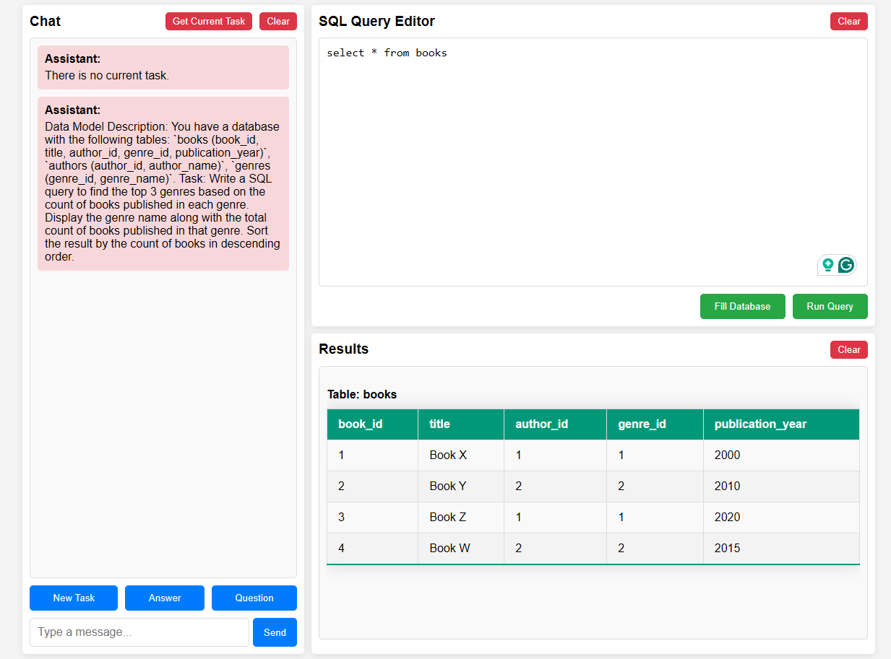

# SQL Buddy. Yor personal SQL assistant.

The AI powered SQL assistant that helps you write SQL queries faster and more efficiently.

This is a learning project for studying Clojure and ClojureScript.

The project's idea: to learn SQL with the help of AI in a user-friendly environment that allows running SQL code on a real database.

Currently, the project implements only the basic concept, but even in this form, it can be useful for learning SQL.

The project is designed with potential for functional expansion and could evolve into a full-fledged SQL trainer.


## Specify the OPEN-API key

You should set the OPEN-API key in the system environment variable `OPENAI_API_KEY` before running the application.

## Development mode (figwheel)

To start the Figwheel compiler, navigate to the project folder and run the following command in the terminal:

```bash
lein figwheel
```

Figwheel will automatically push cljs changes to the browser. The server will be available at [http://localhost:3449](http://localhost:3449) once Figwheel starts up. 

Figwheel also starts `nREPL` using the value of the `:nrepl-port` in the `:figwheel`
config found in `project.clj`. By default the port is set to `7002`.

The figwheel server can have unexpected behaviors in some situations such as when using
websockets. In this case it's recommended to run a standalone instance of a web server as follows:

```bash
lein do clean, run
```

The application will now be available at [http://localhost:3000](http://localhost:3000).

## Development mode (shadow-cljs)

Install shadow-cljs:

```bash
npm install -g shadow-cljs
```

Start shadow-cljs: Navigate to your project directory and start the shadow-cljs server:

```bash 
shadow-cljs watch app
```

Run the development server: In another terminal, start the development server using Leiningen:

```bash
lein run
```

### Optional development tools

Start the browser REPL:

```bash
$ lein repl
```
The Jetty server can be started by running:

```clojure
(start-server)
```
and stopped by running:
```clojure
(stop-server)
```


## Building for release

```bash
lein do clean, uberjar
```

## Building the Docker image

```bash
docker build -f setup/Dockerfile -t sql-buddy .
```

### Running the Docker image

```bash
 docker run -p 3000:3000 -e "OPENAI_API_KEY=your-openai-api-key" sql-buddy  
```

## Application Usage Instructions



- To receive a new task, click on the "New Task" button.
- The "Answer" and "Question" buttons add a prefix to the message to help the system better recognize the type of message.
- If you want to ask the AI something, click "Question". For answering a task, use "Answer".
- To generate data in the database according to the current task, click "Fill Database".
- To execute a query, click "Run Query".

## To Do

### Functional Tasks:
- Save current messages to the database between application sessions.
- Develop a system for tracking learning progress.
- Add the ability to select a task topic.
- Add the ability to select difficulty levels.

### Technical Tasks:
- Implement logging.
- Improve error handling.
- Increase test coverage.
- Enhance the user interface.
- Optimize token usage.
- Enable compatibility with different AI models, including local ones.
